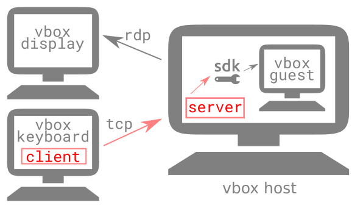

## VirtualBox Remote Keyboard

Very basic client and server that enables forwarding USB keyboard events from any Linux box on the network to a VirtualBox guest.

The client runs on the machine to which the keyboard is connected and the server runs on the VirtualBox host (not guest).

The client captures all keyboard input in exclusive access mode. While the keyboard is being captured, the Scroll Lock LED is on.

The quality of this is project is: I-needed-it-but-didn't-really-have-time-to-write-it.

### Possible use cases

* Use wireless keyboard connected to one computer on the network to control a VirtualBox guest running on a separate VirtualBox host.

* Show VirtualBox guest screen on a tablet with RDP while controlling the guest via a keyboard connected wirelessly to the network via a Raspberry Pi

### Build

* Download and install the VirtualBox SDK

* Settings, such as hostname and port are currently compile time constants

* Set network and keyboard device constants under `Configuration` in `vkb_client.cpp` and `vkb_server.cpp`.

* Run `make` in the `client` and `server` directories

### Implementation

* Technologies: C, C++, VirtualBox SDK, XPCOM, POSIX

* Basic client/server model over TCP/IP using good old fashioned POSIX C calls

* Use the VirtualBox SDK to inject keyboard events into a VirtualBox guest

* Capture USB HID event IDs and translate them to PS/2 keyboard scancodes, which are then sent to the VirtualBox guest

### TODO

* Turn compile time constants into runtime arguments

* Only standard keys found on a full size US English keyboard are translated
